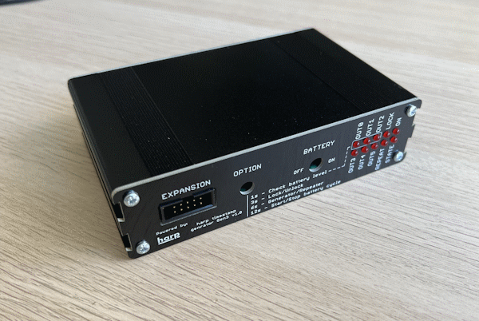

## Harp Timestamp Generator Gen3

This device generates programable timestamps to up to 6 harp devices.

### Key Features ###

* TBA

### Connectivity ###

* TBA

## Interface ##

The interface with the Harp Output Expander can be done through [Bonsai](https://bonsai-rx.org/).

## Licensing ##

Each subdirectory will contain a license or, possibly, a set of licenses if it involves both hardware and software.
